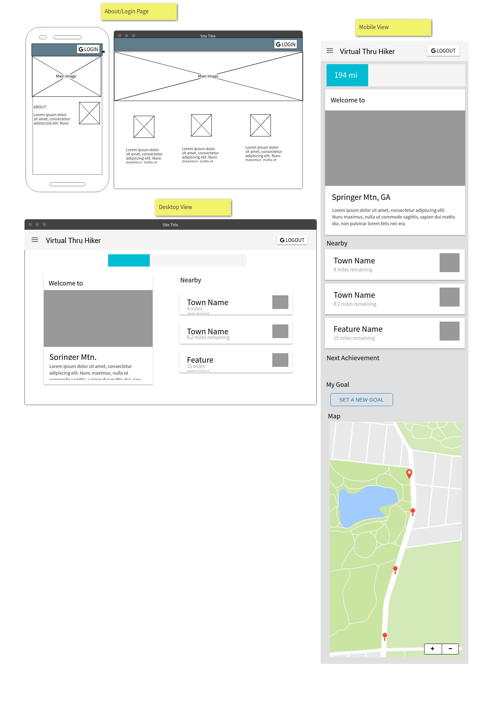

# virtual-thru-hiker
Walk more every day by virtually hiking the AT

**You can do it**: Virtually walk the AT in just **1 year** by meeting your goal of walking/running 6 miles (10,000 steps) per day.

## How to try VTH
First, install [Google Fit](https://www.google.com/fit/) on your phone - this takes care of tracking you walking data.

Second, find the virtual thru hiker app [HERE](https://virtual-thru-hiker.herokuapp.com) and login with google.

Now start walking!

## Installation instructions
* Fork/clone this repo
* `npm install` in the cloned directory to install required node modules
* `mongod` to start mongoDB
* `node seed/seedTrail.js` to seed the trail data
* `mocha` to test if the data was seeded successfully
* `touch .env` and add your env variables (see below)
* `gulp start` to start the dev server
* Open the app in browser at `http://localhost:3000/`

.env should look like this:
```
GOOGLE_CLIENT_ID=<your_google_client_id>
GOOGLE_CLIENT_SECRET=<your_google_client_secret>
BASE_URL=http://localhost:3000
FIT_API_KEY=<your_google_fit_api_key>
```
You can get keys and IDs from [Google Here](https://console.developers.google.com/flows/enableapi?apiid=fitness)

To test the Fit API response:
* Login to the app and copy your `accessToken` from the database into `fitApi_spec.js` - this token expires every hour so it needs to be from a recent login.
* Set the `testApi=true` in `fitApi_spec.js`
* Run `mocha` in the cmd line

## How it works
VTH requests the user's pedometer data from Google's Fit API. It then processes the API data and updates the user's total distance traveled since signing up. The app allows the user to see their progress along the real trail and set personal goals.

Tools used:
### Front-end
* **Bootstrap 4** components (nav, cards, forms, modals, buttons)
* **jQuery** AJAX, Client-side rendering, DOM Manipulation
* **Sass** custom styles

### Back-end
* **Node/Express** Routing, REST, Data handling (controllers)
* **MongoDB/Mongoose** User and app data models, queries
* **PassportJS/OAuth2** express middleware sign in with google, session management, authorize and authenticate users
* **Request** module for making API calls
* **Handlebars** server-side view rendering
* **dotenv** module handle environmental variables

### Development
* **Gulp/Babel** automated processing of client javascript and SCSS
* **Trello/Toggl** plan and track dev process
* **Mocha/Chai** TDD and automated api verification

## Features
*Where am I?* - See where you be along the trail in real life. See the natural points of interest you would be passing. See what towns and shelters you would pass by or stay at if you were on the trail.

*Goals* - set personal goals to motivate you to walk more everyday to reach the end of the trail.

*Overall Progress* - see how far you've come and how far you have yet to go. Truly appreciate the scale of the AT so you can more appreciate your accomplishment in reaching the end.

An average inactive person might only walk 2 or 3 miles per day but a healthy and achievable goal is 6 miles per day. It is possible to walk the entire distance of the AT in 1 year by meeting that goal of 6 miles per day. Real thru-hikers on the AT may hike 10-20 miles a day in order to complete the trail before winter.

## Challenges
***Oauth2*** - using the Google Fit API requires a user to signin to google and authorize access to their data. Google provides several ways to do this. My first approach was to use a signin button that took advantage of the google platform script. See the [documentation](https://developers.google.com/identity/sign-in/web/build-button). This method was initially simple because google handles authentication. The problem was that I wanted to make secure calls to the fit API from my backend and authorize each user to access their app data on my server. I could do this by passing the accessToken and idToken to my server using ajax and then making separate calls to re-verify the user with google and request their Fit data. This is messy and requires authenticating the user in two different places. I instead decided to to all of the authentication on the back-end using `passport` and the `passport-google-oauth2` strategy. This greatly simplified the process. The user clicks the login button which hits the route I setup to handle login. They are then redirected to google to be authenticated and then google redirects them back to my site using a callback address I provide. Now all I have to do is check if the user has been to my site before or not using their unique google ID. Google also provides me with the minimal amount of personal information needed to create their user document in my database and the accessToken needed to get their fit data from the api. The [passport documentation](http://www.passportjs.org/docs/google) was very useful in getting this set up.

***Working with the google fit API*** - google provides an "oauth playground" for testing calls to their APIs. This was extremely useful in getting to know the api. The [documentation](https://developers.google.com/fit/rest/v1/get-started) was not the most straight forward for my application past the initial setup but a [stack overflow article](https://stackoverflow.com/questions/27158645/how-do-i-retrieve-step-count-data-from-google-fitness-rest-api) helped me distill what the the base call I was trying to make should look like:  `https://www.googleapis.com/fitness/v1/users/{userId}/dataSources/{dataSourceId}/datasets/{datasetId}`
The 3 variables here are `userId`, `dataSouceId`, and `datasetId`.
Through the documentation and reviewing some examples, I found that `userId` is ALWAYS `me`.
The `dataSouceId` for getting step count data is `derived:com.google.step_count.delta:com.google.android.gms:estimated_steps`
And finally I found that the the `datasetId` is the start and end time for the data _IN NANO SECONDS_. Not milliseconds. Not microseconds. NANO seconds. Thats your standard Unix Epoch millisecond time with SIX trailing zeros.
Once I had the url built for my query, I had to call it using the `accessToken` I received when the user logged in with google. This goes in the request `headers.Authorization` as `Bearer {accessToken}`. All of that together and google will give you a long array of objects that look like this: 
```javascript
{
      "modifiedTimeMillis": "1507183450833", 
      "startTimeNanos": "1507176600000000000", 
      "endTimeNanos": "1507176660000000000", 
      "value": [
        {
          "mapVal": [], 
          "intVal": 18
        }
      ], 
      "dataTypeName": "com.google.step_count.delta", 
      "originDataSourceId": "raw:com.google.step_count.delta:com.getpebble.android.basalt:"
}
```
I was not expecting this. I was expecting to find a single number for the total step count during the specified time period. It turns out that this is small chunks of pedometer data for small intervals of time. I discovered this by making a call for a full day and writing a reduce function to add up all 247 `value.intVal` numbers. The total matched the number of steps I took that day.
**TL;DR**: Build the url string with start/end times in nanoseconds, call the api with the user's `accessToken` in the head, process the response by totaling all `point.value.intVal`s.

## Planning & Project Management
Trello: https://trello.com/b/5ihoZu1b/thru-hiker

Mockup: 


Prototype:
http://ryan104.github.io/vth-mockups/
http://ryan104.github.io/vth-mockups/app.html

